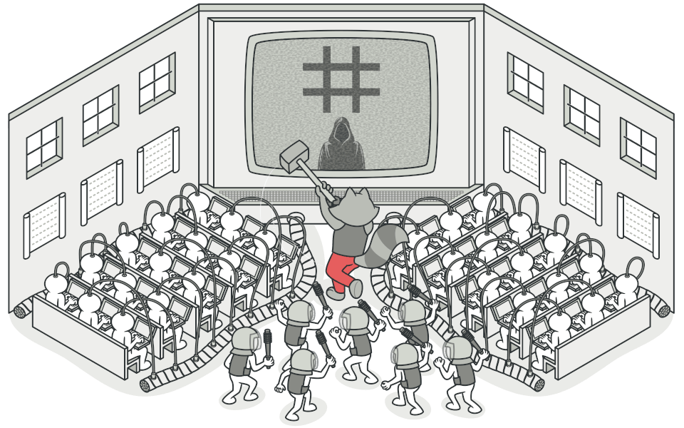

# Design Patterns?

> Design Patterns are **reusable solutions to common software design problems**.

They are NOT:

❌ frameworks\
❌ libraries\
❌ ready-made code to paste

They ARE:

✔ templates\
✔ best practices\
✔ time-tested architectures

Think:

> “Whenever this type of problem appears — here’s a proven, elegant structure that works.”

<figure><figcaption></figcaption></figure>

<figure><figcaption></figcaption></figure>

<figure><figcaption></figcaption></figure>

<figure><figcaption></figcaption></figure>

